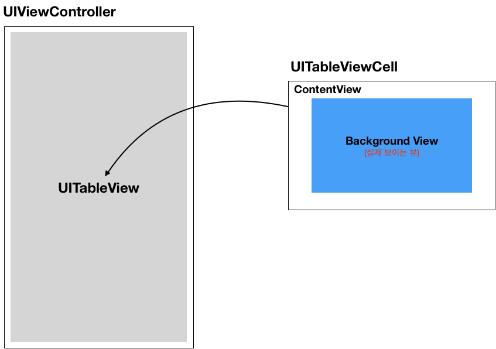

CardyView
===========

## 1. Candy + Card = CardyView
CardyView는 캔디를 먹는 즐거움 처럼 iOS의 Card View를 구현하기 쉽고 재밌게 만들어 주는 라이브러리입니다.

처음 Card View를 구현할 때 많은 방법들을 찾아 하나하나 적용해보면서 가장 쉽고 빠르게 만들 수 있는 방법을 연구하면서 개발한 라이브러리로 Card View를 개발하는 시간을 줄이고, 사용자가 원하는 다양한 배치로 Card View를 구현할 수 있습니다.

CardyView를 사용하여 달콤한 개발을 느껴보세요!



## 2. 사용법
### (1) UITableView

* **UITableView 초기화**

  테이블 뷰를 초기화합니다.
  * backgroundColor : 테이블 뷰의 배경색 (기본값은 clear)
  * spearatorStyle : 셀 구분기호 스타일 (기본값은 none)
```swift
public func initialCardyView(backgroundColor:UIColor = UIColor.clear, spearatorStyle cellSpearatorStyle:UITableViewCellSeparatorStyle = .none)
```

### (2) UITableViewCell

* **UITableViewCell 초기화**

  셀을 초기화합니다.
  * selectionStyle : 셀 선택 시 표현 방법 (기본값은 none)
  * backgroundColor : 셀 배경 색 (기본값은 clear)
  * shadowOffset : 그림자 포인트 (기본값은 CGSize(width: 0, height: 0))
  * shadowColor : 그림자 색 (기본값은 black)
  * shadowOpacity : 그림자 투명도 (기본값은 0.3)
  * shadowRadius : 그림자의 모서리 라운드 값 (기본값은 3)
```swift
public func initCardyView(selectionStyle style:UITableViewCellSelectionStyle = .none, backgroundColor color:UIColor = .clear, shadowOffset:CGSize = CGSize(width: 0, height: 0), shadowColor:UIColor = .black, shadowOpacity:Float = 0.3, shadowRadius:CGFloat = 3)
```

* **Cell 등록**

  CardyView에서는 기존에 TableView에 Custom Cell 등록방식을 좀 더 간편한 방식으로 제공합니다.
```swift
public static func register(tableView: UITableView)
(ex. MyCell.register(tableView: MyTableView)
```

* **Cell dequeueReusableCell**

  CardyView에서는 기존에 dequeueReusableCell 함수를 개선하여 좀 더 간편하고 명확한 방식으로 제공합니다.
```swift
public static func dequeueReusableCell(tableView: UITableView) -> UITableViewCell
(ex. MyCell.dequeueReusableCell(tableView: MyTableView)
```

## 3. 예제소스
* **ViewController**
```swift
class ViewController: UIViewController, UITableViewDelegate, UITableViewDataSource {

    @IBOutlet weak var tableView: UITableView!
    
    var cellDatas:[CellData] = []
    
    override func viewDidLoad() {
        super.viewDidLoad()
        
        setTableView()
        
        setCellDatas()
        
        CardyViewCell.register(tableView: tableView)
    }
    
    func setTableView() {
        tableView.initialCardyView()
        tableView.dataSource = self
        tableView.delegate = self
        tableView.rowHeight = UITableViewAutomaticDimension
        tableView.estimatedRowHeight = 30
    }
    
    func setCellDatas() {
        cellDatas.append(CellData(icon: UIImage(named: "1icon.png"), title: "My MacBook", contents: UIImage(named: "1.jpg")))
        cellDatas.append(CellData(icon: UIImage(named: "2icon.png"), title: "Gray emotion", contents: UIImage(named: "2.jpg")))
        cellDatas.append(CellData(icon: UIImage(named: "3icon.png"), title: "Thorn", contents: UIImage(named: "3.jpg")))
        cellDatas.append(CellData(icon: UIImage(named: "4icon.png"), title: "Rock", contents: UIImage(named: "4.jpg")))
        cellDatas.append(CellData(icon: UIImage(named: "5icon.png"), title: "Organized", contents: UIImage(named: "5.jpg")))
    }
    
    func tableView(_ tableView: UITableView, numberOfRowsInSection section: Int) -> Int {
        return cellDatas.count
    }
    
    func tableView(_ tableView: UITableView, cellForRowAt indexPath: IndexPath) -> UITableViewCell {
        let cell = CardyViewCell.dequeueReusableCell(tableView: tableView) as! CardyViewCell
        cell.setData(data: cellDatas[indexPath.row])
        
        return cell
    }

    override func didReceiveMemoryWarning() {
        super.didReceiveMemoryWarning()
        // Dispose of any resources that can be recreated.
    }
}
```

* **CardyViewCell**
```swift
import UIKit

class CardyViewCell: UITableViewCell {

    @IBOutlet weak var cellBackgroundView: UIView!
    
    @IBOutlet weak var iconImageView: UIImageView!
    @IBOutlet weak var titleLabel: UILabel!
    @IBOutlet weak var contentsImageView: UIImageView!
    
    override func awakeFromNib() {
        super.awakeFromNib()
        // Initialization code
    }
    
    override func layoutSubviews() {
        initCardyView(selectionStyle: .none, backgroundColor: .clear, shadowOffset: CGSize(width: 0, height: 0), shadowColor: .black, shadowOpacity: 0.3, shadowRadius: 3)

        cellBackgroundView.layer.cornerRadius = 10
        cellBackgroundView.layer.masksToBounds = true
        
        iconImageView.clipsToBounds = true
        iconImageView.layer.cornerRadius = 0.5 * iconImageView.frame.size.width
    }

    static func isType() -> Bool {
        return true
    }
    
    func setData(data:CellData) {
        if let icon = data.icon {
            iconImageView.image = icon
        }
        
        if let title = data.title {
            titleLabel.text = title
        }
        
        if let contents = data.contents {
            contentsImageView.image = contents
        }
    }
    
    override func setSelected(_ selected: Bool, animated: Bool) {
        super.setSelected(selected, animated: animated)

        // Configure the view for the selected state
    }
    
}
```

* **결과화면**


## 4. 설치방법
준비중입니다...


## 5. 라이센스 
CardyView는 MIT 라이센스를 사용합니다.
